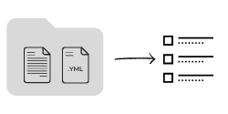

# File-Examples


This repository can be defined as:
- A collection of file examples of different formats.
- Samples of files and structures for everyday use.
- A compendium of links for sample files troughout the internet.

The general ideia, is providing material for those situations in software development or design where you might need to do some unit testing while manipulating real world files.

# How it works



The files are organized in directories named after either their extensions or their context (still working on that). Each folder in the entire directory, is populated with  the file samples and their respectives ```.yml``` files, representing their metadata.

The ```directory.yml``` file, describes the folder metadata and contains ilustratory info, such as, the headers and descriptions that later will be put together in the ```index.md```.

The ```index.md``` file is dynamically built from a Python [script](./meta-files/run_updateIndexFile.py), that amalgamates every metadata file into a single document. While the _metadata .yml files_ themselves are updated and created by another _Python_ [script](./meta-files/run_updateMetadata.py).

The resulting _summary_ of files is presented [here](/index.md). For the specific inner workings consult the [docs section](./meta-files/docs), where everything is describe in detail.

# The Index

- [Index of Example Files](/index.md) in Markdown format
- [Index of Example Files JSON](./meta-files/file-examples.json) in JSON format
- As an experimental webpage: https://thethales.github.io/File-Examples/


